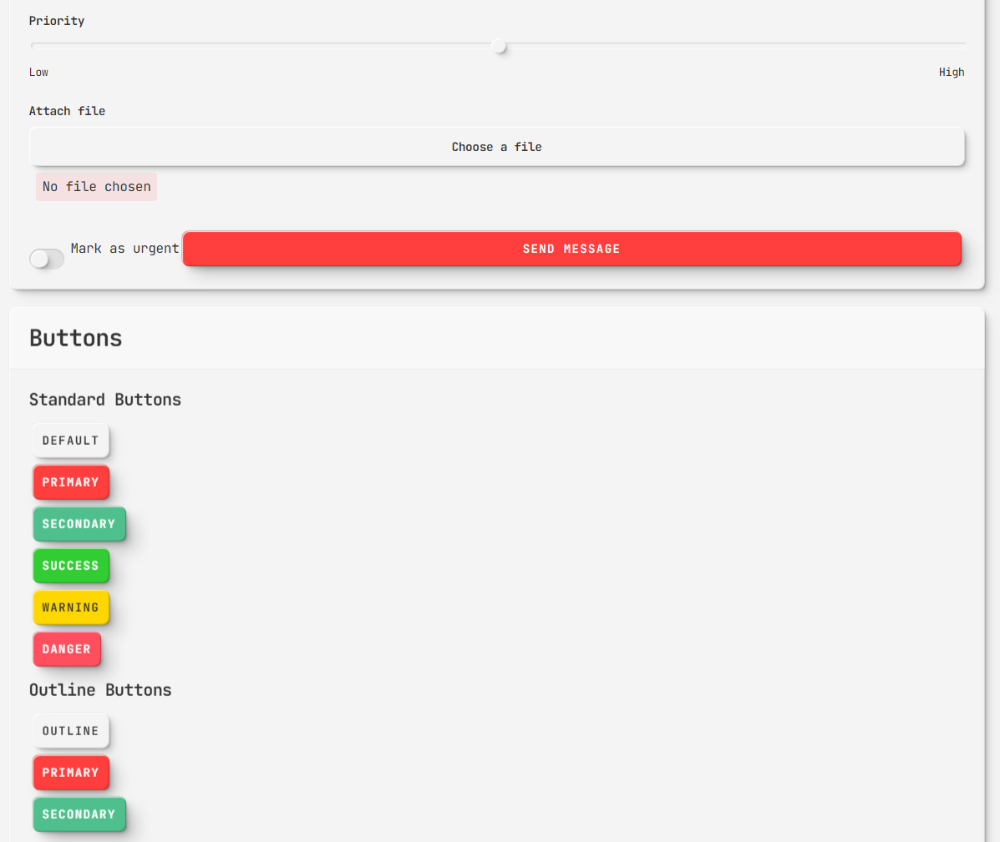

# Neomorphic "NeoMorph UI" CSS

I got inspired by OpenAI FM -  
https://www.openai.fm/

Most form elements are implemented.

---

## List of components 

- [x] Button
- [x] Input
- [x] Select
- [x] Checkbox
- [x] Radio
- [x] Switch
- [x] Table
- [x] Card
- [ ] Modal
- [x] Alert
- [ ] Toast
- [ ] Tooltip
- [ ] Popover
- [x] Pagination
- [x] Progress Bar
- [ ] Spinner
- [ ] Skeleton
- [ ] Slider
- [x] Tabs

---

## Screenshots

Check it out :). 

If you need more components, elements, etc. let me know.

License: MIT

Author: Matija